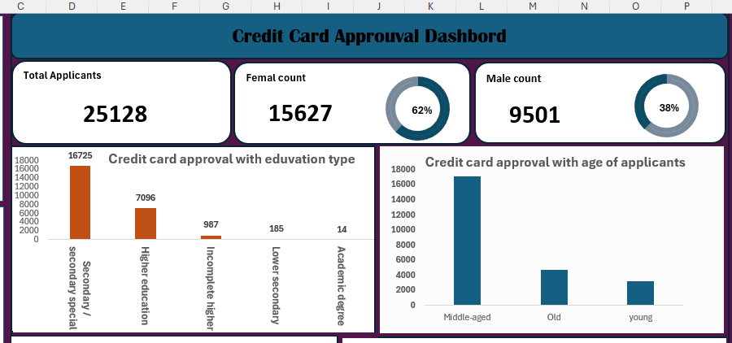

# Credit Card Approval System

## Project overview
This Excel project is a Credit Card Approval System designed to evaluate and decide on credit card applications based on various factors. 
The uses of Excel features is to determine  trend on approval or rejection with respect to those factors.
### Dataset source
The projet Utilizes a credit card application dataset from Kaggle you can find the original dataset [here](https://www.kaggle.com/datasets/caesarmario/application-data).

that includes demographic details (e.g., number of children, gender, marital status) and financial information (e.g., total income,income type,etc.. )
### Problem statement
* Investigate the relationship between applicant demographics  and credit status
* assess the impact of the  income type  on the credit status
* Explore how housing type relate to  the Credit card status
* Examine the relation the job title and  the credit card status
By addressing these aspects, we aim to enhance the understanding of the factors influencing creditworthiness and provide financial institutions with a reliable tool for making credit-related decisions
#### key performance indicators

!

