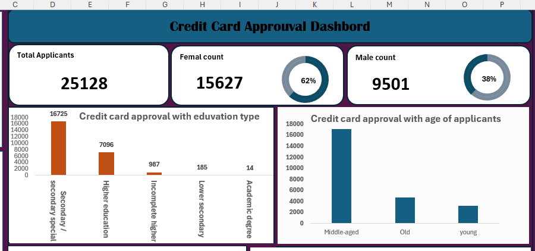

# Credit Card Approval System

## Project Overview
This Excel project is a Credit Card Approval System designed to evaluate and decide on credit card applications based on various factors. 
Using Excel features determines the trends of approval or rejection for those factors.
### Dataset source
The project Utilizes a credit card application dataset from Kaggle. You can find the original dataset [here](https://www.kaggle.com/datasets/caesarmario/application-data).
That includes demographic details (e.g., number of children, gender, marital status) and financial information (e.g., total income, income type , etc.. )

### Problem statement
* Investigate the distribution of gender across applicants
* Examine the relation between the job title and  the credit card approval
* Explore how housing type relates to  Credit card approval
* Assess the impact of the  income type  on the credit card approval

By addressing these aspects, we aim to enhance the understanding of the factors influencing creditworthiness and provide financial institutions with a reliable tool for making credit-related decisions.

## Visualization
#### key performance indicators

### The following chart examines the top 10  job titles of the applicant with approval status

### This chart Explores how housing type relates to  Credit card approval

### Assess the impact of the  income type  on the credit card approval

